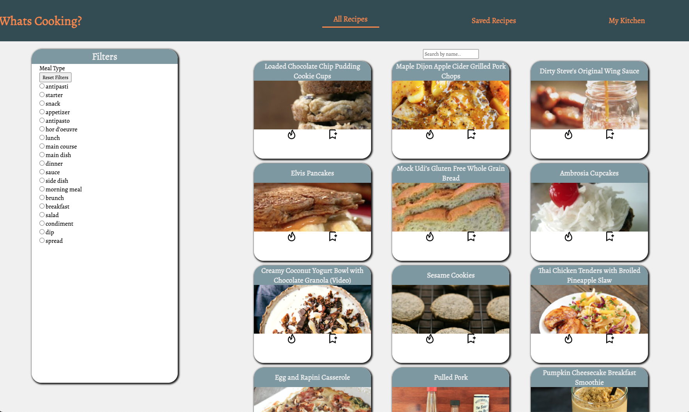
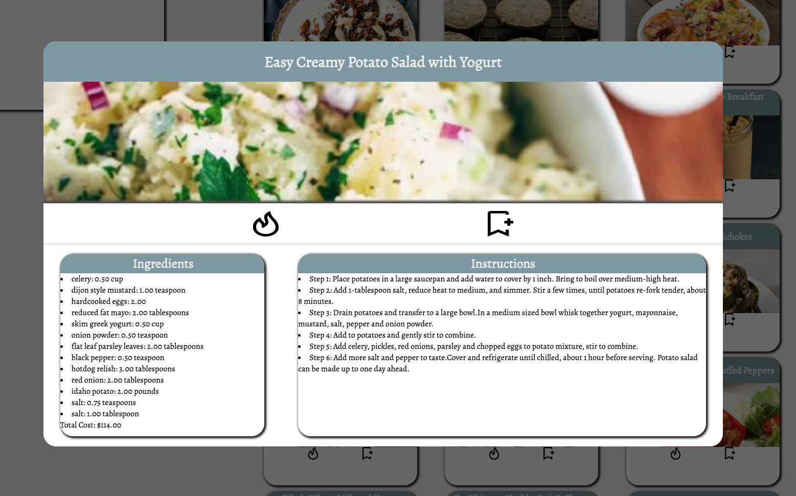
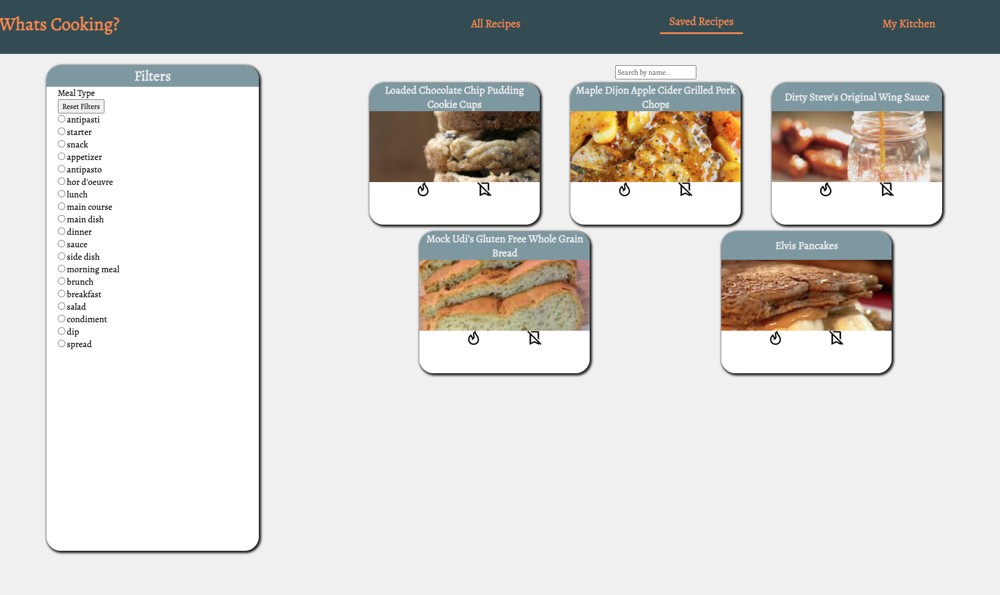
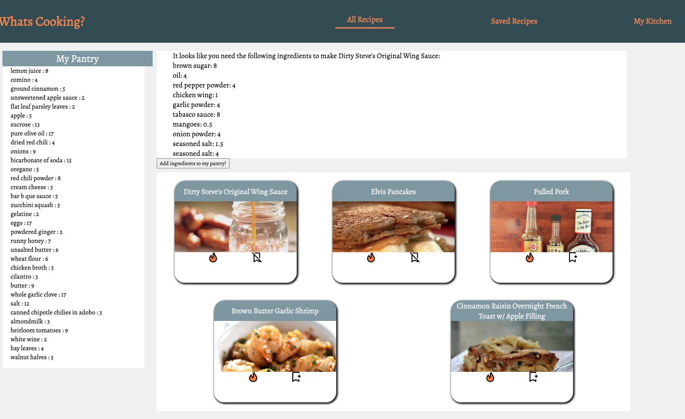

Saved Recipe
<!-- TABLE OF CONTENTS -->

  
Table of Contents

  <ol>
    <li>
      <a href="#about-the-project">About The Project</a>
      <ul>
        <li><a href="#built-with">Built With</a></li>
      </ul>
    </li>
    <li>
      <a href="#getting-started">Getting Started</a>
      <a href="#using-the-application">Using the Application</a>
    </li>
    <li><a href="#usage">Usage</a></li>
    <li><a href="#roadmap">Roadmap</a></li>
    <li><a href="#contact">Contact</a></li>
    <li><a href="#acknowledgments">Acknowledgments</a></li>
    <li><a href="#planning-resources">Planning Resources</a></li>
  </ol>

<!-- ABOUT THE PROJECT -->
## What's Cookin?!

### About The Project

What's Cooking? It's a question we all have had at some point or another, and its a question we were tasked to solve
by Turing School of Software and Design. We were given two weeks to build a fully functional app using a starter repo,
combining HTML, Css, and Javascript to create a well built user experience.

With this application users are able to view a list of recipes fetched from an API. They can save them for future use, or check them against a virtual pantry and have it dynamically update when they 'cook the recipe'.

The key learning goals of this project were to:
- Work with a local server and make network requests to API endpoints to retrieve and manipulate data.
- Write DRY and SRP code to avoid repetitive logic.
- Follow best practices for accessibility.
- Implement feedback to improve product and process between two, one week sections.

(<a href="#top">back to top</a>)

### Built With

In this project, we used these tools to help build, maintain, and populate the Web Application
We were tasked with utilizing data from an API as well as using Webpack for the first time in the Turing program.

#### Languages
* Javascript
* HTML
* Css

#### Frameworks/Libraries
* [JQuery](https://jquery.com)
* [Webpack](https://webpack.js.org/)
* Whats Cookin Starter Kit Api as provided by Turing

(<a href="#top">back to top</a>)

<!-- GETTING STARTED -->
## Getting Started

### Set Up Instructions
1. Clone this repo to your local machine
2. `cd ` into `whats-cooking`
3. Then, run NPM install from your command line: `npm install `
    - Do not run `npm audit fix --force`
4. After you run npm install inside of your copy of this repo, run:
`npm start`
This will run the webpack in the terminal so you can view and use the application in your browser. Your terminal will likely display a large block of text as seen below:

5. Find the line that says `Project is running at http://localhost:8080/` Copy and paste that URL into your browser into your browser. You should have the application set up and ready to use!

6. Make sure that you type `Control + C` in your terminal when you are done using the application. This ensure the server will stop running before your close your Terminal.

### Using the Application

Now that we are all set up for the application, its time for its actual use! When you load the page, You are met with a webpage with a couple basic features. The first is a nav bar, which will allow you to move between three pages: All Recipes, a Saved Recipes section and the "My Kitchen" view where users can see their recipes to cook and their pantry. In both of these pages you are able to filter by a couple different tags using the filters section.
The All Recipes section displays a preview of each recipe with a name, an image, and the ability to save the recipe and or add it to your 'to cook' list, that can be referenced in the Kitchen.  

If you click on a recipe preview, you will see a popup that shows the details of the recipe. This includes a name, image and the save and cook buttons, and the recipe content. At the end of the ingredients list, you will see a total (and reasonable, we're sure) cost of the recipe so you can plan out the cost of your meals.

When viewing all recipes or Saved Recipes, you can select a filter or use the search bar to view a curated subset of the recipes that match your criteria.
When a filter is clicked, the page displays a list of only the recipes with the tag included in the filter or content of the search bar. You can clear your selection with the reset.

(<a href="#top">back to top</a>)

Once you've added recipes to cook, you can go to your Kitchen view and see your virtual pantry to check if you have enough ingredients to cook the selected recipe. If you do not have enough of an ingredient to cook the recipe you will be shown a grocery list and be able to add those ingredients to your pantry, right from your Kitchen

(<a href="#top">back to top</a>)

<!-- ROADMAP -->
## Roadmap

- [x] Add recipe preview and popup data
- [x] Add ability to filter and search for data
- [x] Add ability to save
- [x] Connect data model to api
- [x] Add ability to search regardless of capitalization
- [x] Add ability to make a curated to cook list
- [x] Add ability to view whether user has enough in their pantry to cook the given recipe.
- [x] Add ability to add ingredients to pantry and update API
- [x] Add ability to cook a recipe and reduce pantry amounts in user API based amounts 'used'

_Possible Future Improvements_
- [ ] Add more accessibility
- [ ] Refactor DOM updates to separate modular file
- [ ] Add cook through instructions

(<a href="#top">back to top</a>)

<!-- CONTACT -->
## Contact

Project Credits -
[Michael Putnam](https://github.com/michaelputnam67) |
[Dylan Duke](https://github.com/laytonmaes) |
[Angele Williams](https://github.com/angelewilliams)

Project Git-hub Link: [https://github.com/angelewilliams/whats-cooking](https://github.com/angelewilliams/whats-cooking)

(<a href="#top">back to top</a>)

<!-- ACKNOWLEDGMENTS -->
## Acknowledgments

Use this space to list resources you find helpful and would like to give credit to. I've included a few of my favorites to kick things off!

* [Turing Scool of Software & Design](https://turing.edu/)
* [Evericons Free Use Icons](https://www.figma.com/file/8YZVHqvryXV7hIY30fYAvw/Evericons-(Copy)?node-id=0%3A1)
* [Malven's Flexbox Cheatsheet](https://flexbox.malven.co/)
* [Malven's Grid Cheatsheet](https://grid.malven.co/)
* [GitHub Pages](https://pages.github.com)
* [Font Awesome](https://fontawesome.com)

(<a href="#top">back to top</a>)

<!-- PLANNING RESOURCES -->
## Planning Resources
<!-- WIREFRAME -->

*[Figma Design Board](https://www.figma.com/file/ZnL2l7X37YAklSssxbPX0N/whats-cookin)

*[Figjam Organization Board](https://www.figma.com/file/UaHleoCnL5OAEbzbJAQiA2/whats-cooking)

*[Define the Relationship](https://docs.google.com/document/d/1fmPjAuH9ezEzK54HBJ5oi3jcL1a_o1nIXbc3agiVyt8/edit)

*[Project Specs](https://frontend.turing.edu/projects/whats-cookin-part-one.html)

(<a href="#top">back to top</a>)

